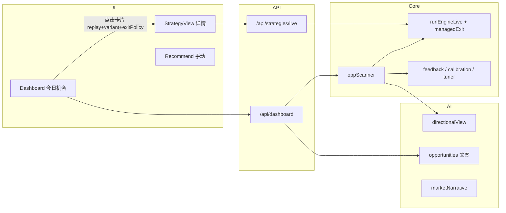

# Option Strategy Engine — 架构与代码审查报告

> 审查视角：系统架构梳理 + 逻辑/产品风险清单（非运行时压测）。
> 初版日期：2026-07-24
> 最近复审：2026-07-24（对照 commit `da7973f`、`12eca8a`、`84081bb` 及 follow-up `replay` 对齐）
> 代码基线：当前 `main` 工作区（含 oppScanner、feedback、tuner、managedExit 等模块）。

**状态图例：** ✅ 已修复 · 🟡 部分修复 / 残留 · ❌ 未修复

---

## 1. 系统框架

### 1.1 分层概览

### 1.2 职责划分

| 层 | 职责 |
|----|------|
| **Client (Vue 3)** | 展示、路由、自选持久化（`localStorage`）、拉 `/api/*`、⌘K 自选 + Finnhub 搜索 |
| **Server 路由** | 聚合行情 / 链 / 财报 / 叙事与文案 / 反馈与搜索 |
| **Engine** | 单标的、多结构、蒙特卡洛 + managed exit + payoff + 打分 + regime；`oppScanner` 跨自选扫「今日机会」 |
| **AI** | 叙事、机会卡片文案、ticker 短评、策略 rationale、方向观点（参与 scanner 上下文） |
| **Cache** | L1 内存 + L2 `cache/*.json`（TTL / 按美东日等） |

### 1.3 主数据流（今日总览）

1. `GET /api/dashboard?symbols=...` → `parseWatchlistSymbolsQuery` → `buildLiveDashboard(watchlist)`
2. 行情 / IVR / IV / 链 → `getScannedOpps` → `buildOppsFromScan`（AI 仅写文案）
3. 扫描器在每条 opp 上冻结 `variant` + `exitPolicy`；Dashboard 跳转时写入 query（含 `replay=1`）
4. 详情页 `POST /api/strategies/live`：`replay` 或 `variants` 时强制 `SCAN_SIMULATIONS`；经 `specOverridesFromVariants` 重建 leg spec
5. 仅 `boardTier === 'qualified'` 的快照写入 feedback（`recordDashboardScanSnapshots`）

### 1.4 设计意图（代码中体现较清晰的部分）

- **引擎选结构**，LLM 主要负责叙述与解释（`server/src/ai/opportunities.ts`）。
- **卖波动门禁**：`sellVolTier` + IVR 下限 + 财报 spanning 过滤（`server/src/engine/oppScanner.ts`）。
- **反馈闭环**：快照 → outcome → `calibration` / `tuner` / `viewSkill` 权重。
- **自选单一默认源**：`server/src/watchlistDefaults.ts` + `GET /api/watchlist/default`。
- **卡片→详情结构 + 数值复现**：tuner variant + condor exitPolicy + `replay=1` → 服务端 `SCAN_SIMULATIONS`（commit `12eca8a`、`84081bb` 及 follow-up）。

---

## 2. 做得好的地方

1. **`deriveRegime` 的 IV−RV + IVR 降级**（`server/src/engine/index.ts`）比「只看 IVR」更接近实务思路。
2. **`managedExit` + 反馈用同一套 POP/EV**，学习信号与展示口径方向一致（`server/src/engine/scorer.ts`）。
3. **`sellVolTier`、财报 spanning 过滤、相关性感知的 `selectDiverse`** — 产品层有明确门禁。
4. **`viewSkill` 把未证实的 directional AI 权重归零**（`server/src/feedback/viewSkill.ts`）— 避免 AI 在缺乏 track record 时硬指挥选结构。
5. **`specOverridesFromVariants` + 单测** — variant → legs 重建路径有单元测试锁住（`server/test/tuner.test.ts`）。
6. **`server/test/`** — 102/102 通过；覆盖 regime、tuner、managed exit、diversify、exitPolicy、卡片 replay 等。

---

## 3. 问题清单（含修复状态）

### 3.1 卡片与详情页不一致 🟡 主路径已闭合，仍有边界

**初版问题（高优先级）**

卡片 legs / POP / EV 来自扫描器（tuner 最优 arm、condor `exitPolicy`、`SCAN_SIMULATIONS`）；详情页曾只传 `sym/exp/id`，用静态默认腿 + 5000 sim 重跑 → **展示路径 ≠ 执行路径**。

**已修复**

| 环节 | 改动 |
|------|------|
| `oppScanner` | 每条 opp 写入 `variant`、`exitPolicy`；导出 `SCAN_SIMULATIONS = 2000` |
| `opportunities.ts` | DTO 输出上述字段 |
| `Dashboard.goStrategy` | query 携带 `variant`、`exitPolicy`、**`replay=1`** |
| `StrategyView` | `replay` 时传 `replay: true`（不再硬编码 5000 sim） |
| `strategiesLive.ts` | `variants` 或 **`replay`** → 强制 `SCAN_SIMULATIONS`；默认 `pickExitPolicy(symbol)` 给 iron_condor |
| `tuner.ts` | `specOverridesFromVariants` |
| `tuner.test.ts` | 断言 `metrics.probabilityProfit` / `metrics.ev`（非顶层 `pop`/`ev`） |

**从 Dashboard 点卡片**：tuned 与非 tuned 结构在**相同链价**下，POP/EV 应与卡片一致（同 seed + sim 数 + legs/exitPolicy）。

**仍存在的边界（非 blocker）**

| 残留 | 说明 |
|------|------|
| **链价刷新** | 同一结构的 strike 相同，但 bid/ask 变 → `netPremium` 可能漂移 |
| **未冻结 metrics** | 仍是重跑引擎，非展示扫描快照 |
| **深链 / 手工 URL** | 不带 `replay=1` / `variant` 的 `/strategy` 仍按 Recommend 口径（5000 sim、静态腿） |
| **Recommend 页** | 手动探索仍用 5000 sim，与 Dashboard 卡片口径不同（符合预期） |

**后续建议（可选）**

- 卡片快照 API / sessionStorage 冻结 legs + metrics（消除链价漂移）
- `buildEngineBuckets` 单测

**相关代码**

- `client/src/views/Dashboard.vue` — `goStrategy`
- `client/src/views/StrategyView.vue` — `fetchLiveStrategies`
- `server/src/routes/strategiesLive.ts`
- `server/src/feedback/tuner.ts` — `specOverridesFromVariants`
- `client/src/utils/constants.ts` — `SCAN_SIMULATIONS`（须与 server 同步）

---

### 3.2 Dashboard 引擎分桶分类有误 ✅ 已修复

**初版问题**（`server/src/routes/dashboard.ts` → `buildEngineBuckets`）

`bull_put_spread` / `bear_call_spread` 是信用卖方，却被放进「看涨结构 / 事件交易」，未进入「卖方结构」。

**修复（commit `da7973f`）**

按**结构机制**分桶，而非方向 bias：

- **卖方结构**：`iron_condor`、`short_strangle`、`bull_put_spread`、`bear_call_spread`
- **看涨结构**：`bull_call_spread`
- **事件交易**：`long_straddle`、`bear_put_spread`

**测试缺口**：`buildEngineBuckets` 尚无单测，建议补回归。

---

### 3.3 AI 方向预取里 `iv` 字段语义混用 ❌ 未修复

**现象**（`server/src/engine/oppScanner.ts` Phase 0）

- 预取阶段**没有期权链**，无法得到 ATM IV。
- 仍将 **RV 作为 `ivEstimate`** 写入 `SymbolContext.iv`，供 `getDirectionalViews` 使用。
- Prompt 中字段名为 **IV**，模型会按隐含波动理解，实际是 **realized vol 代理**。

**已修复（regime，初版审查中确认）**

- 预取 `regime` 已改为 `deriveRegime(ivrVal, 0, undefined)`，走 IVR 分位兜底，**不再**用假 `currentIv=0.3` 与 RV 做 gap。

**残留风险**

- IV 叙事仍可能偏；`viewSkill` 对 directional view 权重为 0 时，对**最终选结构**影响有限，但会浪费 token，且 UI 上 `aiViewReason` 可能显得「专业」而基底不牢。

**建议**

- 预取阶段 `iv: null`，Prompt 明确「链未拉，无 ATM IV，请依赖 IVR/RV」。
- 或等 `scanSymbol` 拿到链后再批量补一轮 view（成本更高）。

---

## 4. 中等风险（设计债 / 运维）

| 问题 | 状态 | 说明 |
|------|------|------|
| **Warmer 与用户自选不一致** | ❌ | `buildLiveMarketSnapshot()` 仍固定 `DEFAULT_WATCHLIST`（`server/src/ai/scheduler.ts`），与用户浏览器自选可能不同。 |
| **旧缓存 `boardTier` 缺失** | ❌ | 前端 `(o.boardTier ?? 'qualified')` 会把**无 tier 的旧缓存机会当正式推荐**（`client/src/views/Dashboard.vue`）。 |
| **`edge` 文案误导** | ✅ | `formatEdge(ivr)` 已改为「IVR 极高/偏高/…」描述标签，不再使用 σ 式启发式（`server/src/ai/opportunities.ts`）。 |
| **默认自选规模** | ❌ | `DEFAULT_WATCHLIST` 已扩至多 sector / ETF；单次 scan API 调用量大，MarketData 配额仍是硬约束。 |
| **无 API 鉴权** | ❌ | 公网暴露会烧 DeepSeek / MarketData / Finnhub，且 `/api/feedback/*` 可读。 |
| **regimeBonus 注释** | ✅ | 注释已与实现一致（1.5×，commit `da7973f`）。 |
| **卡片↔详情集成测** | 🟡 | `tuner.test.ts` 已断言 legs + `metrics.*`；仍无 HTTP E2E。 |

---

## 5. 模型与数据语义（用户预期管理）

- **POP / EV / CVaR** 来自模拟 + managed exit 规则，**不是**交易所结算意义上的 P&L。
- **反馈 outcome** 的 P&L 为简化口径（日收盘 + 到期式 intrinsic 等），用于**相对比较与校准**，不能当回测净值。
- **IVR 来源**：`ivrSource === 'rv-fallback'` 时，分位是 RV 代理，UI 已部分标注（Dashboard `ivr-src`）；叙事层需避免把其说成「卖方天堂」。
- **卡片 vs 详情 POP**：Dashboard 卡片路径（`replay=1`）与扫描器同 sim 数；链价刷新仍可能导致 premium 小幅偏差。若要「所见即所算」，需冻结快照而非重跑。

---

## 6. 已修复项汇总

| 项 | 说明 | 确认方式 |
|----|------|----------|
| **oppScanner 预取 `deriveRegime`** | 曾用 `deriveRegime(ivrVal, 0.3, rvVal)` 导致 IV−RV gap 失真；已改为 `deriveRegime(ivrVal, 0, undefined)` | 代码 + 初版审查 |
| **opportunities 文案 debit/credit** | 曾把 debit spread 写成「权利金收入」；已通过 `positionKind` / `netPremiumWords` 约束 | 初版审查 |
| **自选默认列表** | 服务端 `watchlistDefaults.ts` + `GET /api/watchlist/default` 作为单一默认源 | 初版审查 |
| **引擎四桶分类** | 信用价差归入卖方桶（commit `da7973f`） | 代码复审 |
| **regimeBonus 注释** | 1.8× → 与实现 1.5× 对齐（commit `da7973f`） | 代码复审 |
| **卡片→详情 leg + POP/EV** | variant + exitPolicy + `replay` + `SCAN_SIMULATIONS` + `pickExitPolicy` | commit `12eca8a`、`84081bb` + follow-up |
| **`edge` 展示文案** | IVR 分档描述，非 σ 启发式 | 代码复审 |
| **opportunities DTO 断链** | `variant` / `exitPolicy` 服务端现已填充 | commit `12eca8a` |

---

## 7. 检察官结论（复审版）

| 维度 | 评价 |
|------|------|
| **架构** | 分层清楚：引擎 / 扫描 / AI / 反馈，职责边界总体可辨。 |
| **量化诚实度** | 模拟 + 管理退出有自觉；POP/EV 仍不能当实盘胜率。 |
| **初版最大硬伤** | 卡片腿结构 / POP/EV ≠ 详情 → **Dashboard 主路径已闭合**；链价刷新与无 `replay` 深链仍有边界。 |
| **初版次要硬伤** | 四桶分类 → **已修复**；预取 IV 语义 → **仍未修复**。 |
| **是否「整个引擎写错了」** | **否** — `runEngineLive` 主路径相对自洽；历史问题多在 **UI 跳转、展示分类、AI 上下文**。 |

---

## 8. 建议修复优先级（复审后）

| 优先级 | 项 | 状态 |
|--------|-----|------|
| P0 | Strategy 详情复现扫描 **leg 结构 + POP/EV**（variant + exitPolicy + replay + sim） | ✅ 主路径已完成 |
| P0 | 修正 `buildEngineBuckets` | ✅ 已完成 |
| P1 | 预取阶段 `iv: null` + Prompt 约束 | ❌ 待做 |
| P2 | 卡片快照 API / 冻结 metrics（消除链价 premium 漂移） | ❌ 待做 |
| P2 | `buildEngineBuckets` 单测 + HTTP E2E | ❌ 待做 |
| P3 | Warmer 与用户自选对齐，或文档明确「仅预热默认列表」 | ❌ 待做 |
| P3 | API 鉴权 / feedback 写操作保护（若对外部署） | ❌ 待做 |
| P3 | 旧缓存 `boardTier` 缺失时的降级策略 | ❌ 待做 |

---

## 9. 关键文件索引

| 模块 | 路径 |
|------|------|
| 引擎入口 | `server/src/engine/index.ts` |
| 机会扫描 | `server/src/engine/oppScanner.ts` |
| Dashboard 聚合 | `server/src/routes/dashboard.ts` |
| 策略详情 API | `server/src/routes/strategiesLive.ts` |
| Variant 重建 | `server/src/feedback/tuner.ts` |
| AI 文案 | `server/src/ai/opportunities.ts` |
| AI 方向 | `server/src/ai/directionalView.ts` |
| 反馈校准 | `server/src/feedback/calibration.ts` |
| View 权重 | `server/src/feedback/viewSkill.ts` |
| 自选默认 | `server/src/watchlistDefaults.ts` |
| 前端 Dashboard | `client/src/views/Dashboard.vue` |
| 前端 Strategy | `client/src/views/StrategyView.vue` |
| Variant 单测 | `server/test/tuner.test.ts` |

---

## 10. 修订记录

| 日期 | 说明 |
|------|------|
| 2026-07-24 | 初版：架构梳理 + 问题清单 |
| 2026-07-24 | **复审更新**：标记 3.1/3.2/edge/regimeBonus 修复状态；补充残留差距与测试缺口 |
| 2026-07-24 | **PR follow-up**：`replay=1` 对齐非 tuned 策略 sim 数；修正单测 `metrics.*` 断言；文档同步 |
