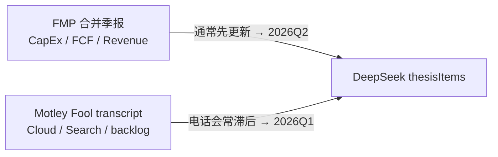

# OCIFQ Thesis Tracker — 财报季对齐修复

> 修复日期：2026-07-24  
> 分支：`fix/ocifq-quarter-alignment`  
> 问题：Deep Analysis Thesis Tracker 同页混用 **2026Q1** 与 **2026Q2**（如 Cloud 写 Q1、CapEx 写 Q2）

---

## 1. 现象

用户在 Q2 财报发布次日打开 Deep Analysis，Thesis Tracker 出现：

| 卡片 | delta 中的季度 | 指标示例 |
|------|----------------|----------|
| #1 Cloud 增长 | **2026Q1** | Cloud +63%、backlog |
| #2 Search | **2026Q1** | Search +19% |
| #3 CapEx | **2026Q2** | CapEx $44.9B、FCF 为负 |

卡片右上角日期均为 **2026-07-24**（分析日），容易误以为都是同一季数据。

---

## 2. 根因

OCIFQ 分析 (`server/src/intel/deepAnalysis.ts`) 合并 **两类数据源**，各自「最新一季」可能不同步：



| 层级 | 说明 |
|------|------|
| **数据** | 财报发布后 FMP 已有 Q2 现金流量表；Fool 上 Q2 电话会 transcript 可能尚未上架 |
| **Pipeline** | `scrapeRecentTranscripts` 曾 **忽略** 传入的 FMP `income[0]`，只取 Fool 列表最新项 |
| **Prompt** | 未声明「FMP 最新季 vs transcript 最新季」；未禁止 thesisItems 跨季混写 |
| **缓存** | `ocifq-v4-${day}-${sym}` 按自然日缓存，新季财报不会自动 bust |
| **UI** | 无 lag 提示；`date` 字段是分析日而非财报季 |

---

## 3. 修复方案

### 3.1 新增 `quarterContext` 模块

**文件：** `server/src/intel/quarterContext.ts`

- 从 FMP `income[0]` 与 `transcripts[0]` 解析 fiscal quarter
- 检测 `lag`（FMP 严格新于 transcript）
- 生成注入 LLM 的 **Quarter Alignment** 提示块 + UI 用 `lagMessage`

### 3.2 Transcript 抓取优先 FMP 目标季

**文件：** `server/src/api/transcriptScraper.ts`

- `scrapeRecentTranscripts` 使用 FMP `income[0]` 的 `fiscalYear` + `period`
- 若 Fool 已有该季 transcript → 优先抓取
- 若尚未上架 → 打 log `[transcript] … quarter lag`，回退 Fool 最新

### 3.3 Prompt 硬约束

**文件：** `server/src/intel/deepAnalysis.ts`

- SYSTEM_PROMPT 增加 **thesisItems 季度一致性** 规则（合并口径 vs 分部口径）
- `buildUserPrompt` 开头插入 `quarterCtx.promptLines`
- JSON schema 增加 `referenceQuarter` 字段
- 缓存 key 升级为 **`ocifq-v5-${fmpLatestQuarter}-${day}-${sym}`**

### 3.4 API 响应与 UI

| 字段 | 说明 |
|------|------|
| `quarterContext.fmpLatest` | FMP 最新合并报表季，如 `2026Q2` |
| `quarterContext.transcriptLatest` | 电话会 transcript 季，如 `2026Q1` |
| `quarterContext.lag` | 是否滞后 |
| `quarterContext.message` | 中文提示条文案 |
| `thesisItems[].referenceQuarter` | 该论点主要引用的财报季 |

**UI：** `DeepAnalysis.vue` — lag 时显示警告条；每条 thesis 显示 `referenceQuarter`；数据来源区展示 FMP / 电话会最新季。

---

## 4. 修改文件清单

| 文件 | 变更 |
|------|------|
| `server/src/intel/quarterContext.ts` | **新增** — 季度解析与 lag 检测 |
| `server/src/intel/deepAnalysis.ts` | Prompt、缓存 key、quarterContext 输出 |
| `server/src/api/transcriptScraper.ts` | FMP 目标季优先排序 |
| `server/test/quarterContext.test.ts` | **新增** — 单元测试 |
| `client/src/types.ts` | `quarterContext`、`referenceQuarter` 类型 |
| `client/src/views/DeepAnalysis.vue` | lag 横幅 + 季度标签 |
| `docs/ocifq-quarter-alignment.md` | 本文档 |

---

## 5. 验证

```bash
cd server && npm test          # 含 quarterContext.test.ts
cd server && npm run check     # tsc + tests
```

**手动：** Q2 财报刚发布后打开 Deep Analysis →

1. 若 transcript 仍滞后：应看到 **红色 lag 横幅**，Thesis delta 不再混写 Q1 合并 + Q2 分部而不标注
2. Fool 上架 Q2 transcript 后：重新生成（或等 cache bust）→ `fmpLatest` 与 `transcriptLatest` 均为 `2026Q2`，lag 消失

---

## 6. 已知边界

- **链式依赖 Fool 上架速度**：FMP 已 Q2、Fool 仍 Q1 时，分部指标只能标注「Q1 电话会」或省略，无法凭空生成 Q2 分部数
- **LLM 仍可能违规**：Prompt 约束 + `referenceQuarter` 可审计，但未做 delta 文本的程序化校验
- **Transcript 磁盘缓存 30 天**：Q2 上架后首次 scrape 会写入新缓存；旧 Q1 缓存仍保留但不影响「优先 Q2」逻辑
- **⚠ 反向滞后未处理（审核 follow-up，2026-07-24）**：`buildQuarterContext` 只在 **FMP 领先 transcript** 时报 lag。若反过来——transcript 已发布但 FMP 合并财报未更新（少见但可能）——分部数据比合并财报**新**，却会被贴上更旧的 FMP 季标签，且**无横幅警示**。当前只覆盖常见方向（FMP 领先，即 Intel 的原 bug）。补法见 §7 第 4 条。

---

## 7. 后续可选

1. delta 后处理：正则检测 `20\d{2}Q[1-4]` 是否与 `referenceQuarter` 一致
2. transcript 源增加 FMP paid API 作为 Fool 的补充
3. 新季 earnings 事件主动 bust OCIFQ 缓存（webhook / cron）
4. **对称 lag 检测**（审核 follow-up）：`buildQuarterContext` 增加 transcript **领先** FMP 的分支（`compareFiscal(transcriptLatest, fmpLatest) > 0`），此时应警示「分部数据比合并财报新」并让合并指标标注更旧的 FMP 季，防止把新分部数误贴旧季标签。改动集中在 `buildQuarterContext`，另开分支处理。

---

## 8. 修订记录

| 日期 | 说明 |
|------|------|
| 2026-07-24 | 初版：Q1/Q2 混用修复与文档 |
| 2026-07-24 | 审核 follow-up：记录反向滞后局限（§6）+ 对称 lag 检测建议（§7.4）|
